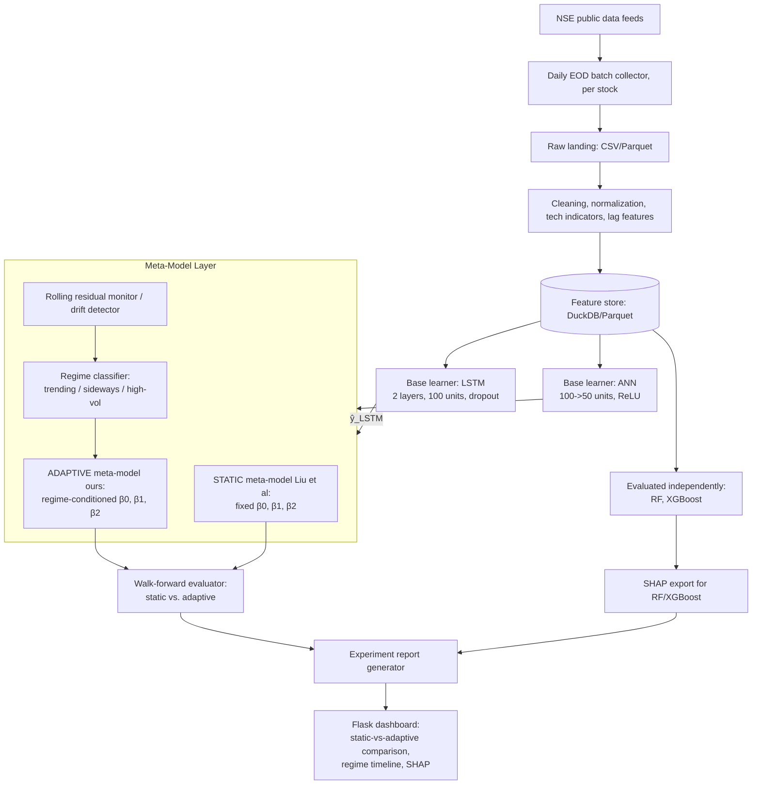

# System Architecture (v4: Liu et al. Adaptive Extension)

**Primary Tech Stack:** Python (Pandas, PyTorch/Keras for LSTM/ANN, XGBoost, SHAP, Flask), DuckDB/Parquet

## 1. Core Architecture Components

### Data Ingestion & Storage Layer
- **Mechanism:** Daily End-of-Day (EOD) batch script using `yfinance` API calls with 3-retry exponential backoff. (Legacy 5-minute polling is explicitly deprecated to match daily forecasting). Per-stock ingestion. (Kafka/streaming deferred to future work.)
- **Coverage:** 25–30 NSE stocks across 5 sectors (Banking, IT, FMCG, Auto, Pharma), 5–6 stocks per sector.
- **Precondition:** Stocks must have a minimum of 400 trading days of history. Stocks with insufficient history must be automatically dropped.
- **Feature Store:** **Supabase (PostgreSQL)** partitioned by stock. Contains OHLCV, lag features, and technical indicators (RSI, MACD, Bollinger Bands, rolling volatility).
- **Experiment Variation:** At least one experiment must be run on *returns* instead of raw price levels to address potential R² inflation when comparing results against Liu et al.

### Base Learners (Adopted from Liu et al. 2024)
- **Note:** We adopt *only* their mathematical architecture. We explicitly reject their experimental setup, which contains mathematically impossible dataset claims and global scaling leakage.
- **LSTM:** 2 layers, 100 units each, with dropout.
- **ANN:** 2 hidden layers (100 ReLU units -> 50 units).
- **Execution:** Independently trained on a per-stock basis. Outputs `ŷ_LSTM` and `ŷ_ANN`.
- **Anti-Leakage Validation:** All feature scaling is fit per-fold (out-of-sample), never globally.

### Static Meta-Model (Control Condition)
- **Mechanism:** The original Liu et al. linear regression stacking method.
- **Equation:** `ŷ_meta = β₀ + β₁·ŷ_LSTM + β₂·ŷ_ANN + ε`
- **Primary Evaluation:** Fit once per fold within the walk-forward CV harness.
- **Secondary Evaluation:** Also run once using the original Liu et al. single-TimeSeriesSplit approach as an explicit secondary comparison point — this allows direct comparison between their evaluation methodology and ours.

### Adaptive Meta-Model (Our Contribution)
- **Drift Detector:** Monitors rolling residual error of the meta-model's predictions using a rolling z-score threshold (**30-day window, |z| > 2.0**); Page-Hinkley test is a stretch upgrade only if time allows.
- **HMM Regime Classifier:** A **Hidden Markov Model (HMM)** is fitted per stock on (daily log-returns, 20-day rolling realized volatility) to identify latent market states. Compared to a simple ATR volatility tercile cut, HMM produces a principled probabilistic state sequence with explicit transition probabilities. Starting number of hidden states: **3** (low-volatility trending / high-volatility trending / sideways); optimal number validated per stock using BIC/AIC [TODO: Verify from implementation]. The HMM operates on the returns/volatility series directly, separate from the prediction feature set, to avoid mixing regime signals with base-learner input features.
- **Adaptive Stacking:** Extends the static equation to be regime-conditioned.
- **Equation:** `ŷ_meta(t) = β₀(r_t) + β₁(r_t)·ŷ_LSTM + β₂(r_t)·ŷ_ANN + ε`
- **Implementation:** Rolling re-fit of the meta-model on a **60-day lookback window**, triggered when the drift detector fires. Uses **Bayesian Ridge Regression** (instead of plain Ridge/OLS) to simultaneously prevent singular matrix errors and produce posterior distributions over β₁ and β₂, enabling uncertainty-quantified coefficient reporting across regimes in the paper. Prior hyperparameters: scikit-learn defaults initially [TODO: Verify from implementation].

### Serving & Dashboard Layer (New Stack)
- **Function:** Cloud-deployed distributed system. **Node.js** API (Render/AWS), **React** Web App (Vercel), and **React Native** Mobile App.
- **UI/UX:** Includes a dropdown selector for the 25-30 tickers. The main view is a static-vs-adaptive comparison showing the frozen meta-model's predictions next to the regime-adaptive version, along with a "Regime Timeline". Must include an empty state card ("Backtest results not available") if the selected ticker has no data in Supabase.
- **Data Contract:** Node.js API reads from the Supabase table: `[Date, Ticker, Actual_Return, Actual_Price, y_hat_Static, y_hat_Adaptive, Regime_Flag]`.
- **Additional Baselines:** RF and XGBoost evaluated independently with SHAP explainability. SHAP is applied to tree models only (RF, XGBoost) — not to LSTM/ANN base learners.
- **Export:** CSV/Parquet export of results retained.

## 2. Architecture Diagram

## 3. Non-Goals (explicitly out of scope)

- Live order execution or brokerage integration
- Options / derivatives data
- Tick-level HFT data
- Production-scale Kafka cluster (single-broker local instance or Redis Streams is sufficient if streaming is added in a future iteration)
- Temporal Fusion Transformer (TFT) — deferred to future work; cite as related work in the paper
- Sentiment / news ingestion — deferred to future work
- SHAP for LSTM/ANN base learners

## 4. Novelty Claims (three-part, for the paper)

1. **First application** of the Liu et al. LSTM+ANN stacking ensemble to Indian NSE equities (no existing paper does this, per the literature scan).
2. **HMM-based regime-adaptive extension** of their static meta-model coefficients — uses a principled Hidden Markov Model to detect latent market states rather than a fixed volatility threshold, tested against the original static version as a clean, single-variable ablation.
3. **Bayesian Ridge Regression meta-model** — replaces plain Ridge re-fitting with a Bayesian formulation that provides posterior uncertainty estimates on ensemble weighting coefficients (β₁, β₂), enabling statistically grounded interpretation of how base-learner reliance shifts across market regimes.